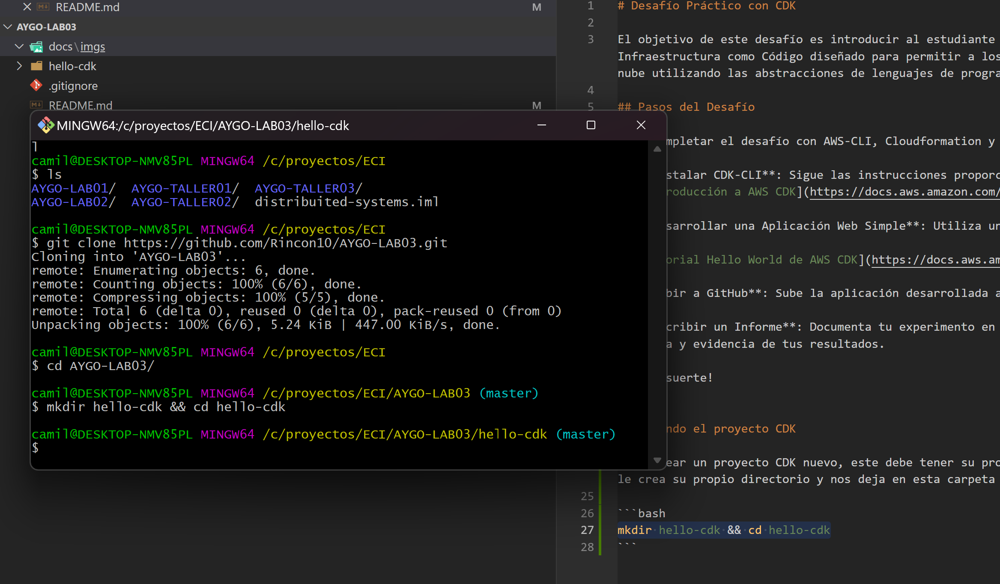
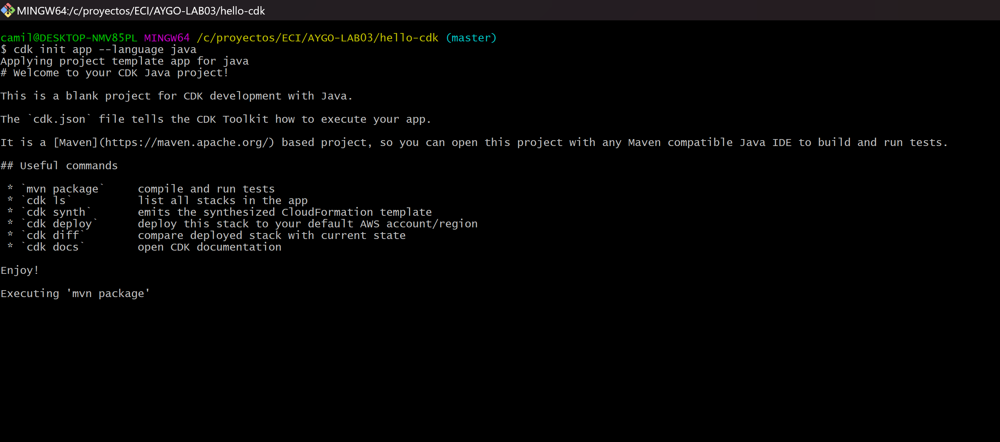
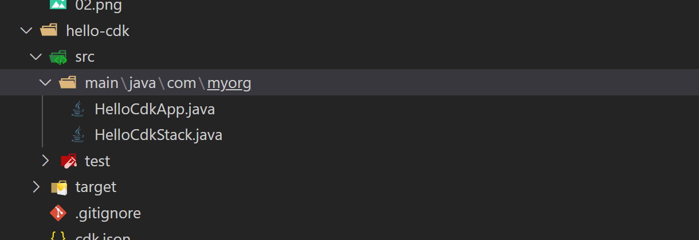

# Desafío Práctico con CDK

El objetivo de este desafío es introducir al estudiante al CDK a través de un ejercicio práctico. CDK es un framework de Infraestructura como Código diseñado para permitir a los arquitectos diseñar topologías de infraestructura complejas para la nube utilizando las abstracciones de lenguajes de programación comunes.

## Pasos del Desafío

Para completar el desafío con AWS-CLI, Cloudformation y CDK, el estudiante debe completar los siguientes pasos:

1. **Instalar CDK-CLI**: Sigue las instrucciones proporcionadas en la documentación oficial:
   [Introducción a AWS CDK](https://docs.aws.amazon.com/cdk/v2/guide/getting_started.html)

2. **Desarrollar una Aplicación Web Simple**: Utiliza una función lambda con CDK. Para completar este paso, sigue el tutorial en:
   [Tutorial Hello World de AWS CDK](https://docs.aws.amazon.com/cdk/v2/guide/hello_world.html)

3. **Subir a GitHub**: Sube la aplicación desarrollada a un repositorio en GitHub.

4. **Escribir un Informe**: Documenta tu experimento en el README del repositorio de GitHub. Asegúrate de agregar capturas de pantalla y evidencia de tus resultados.

¡Buena suerte!


## Creando el proyecto CDK

para crear un proyecto CDK nuevo, este debe tener su propio directorio, para esto ejecutaremos el siguiente comando, el cual le crea su propio directorio y nos deja en esta carpeta

```bash
mkdir hello-cdk && cd hello-cdk
```




ahora para inicializar un proyecto cdk utilizaremos cdk init y en nuestro case lo haremos en base a java
```bash
cdk init app --language java
```



si todo sale bien en nuestra carpeta se creo una estructura java como la siguiente




## Ahora procederemos a configurar el ambiente de AWS

primero debemos determinar el ambiente que usaremos, para esto necesitamos determinar 
1. Cuenta AWS
2. Region de AWS

en mi caso tengo la siguiente informacion, desde el gui de aws

```
AWSAccountId	134744162619
Region	us-east-1
```


pero si desea consultarla desde consola, puede usar el siguiente comando 


si necesitaras saber la region configurada de tu aws cli

```bash
aws configure get region
```

ahora vamos a modificar nuestro HellocdkApp, de tal manera que tome la configuracion de nuestra cuenta

```java
public class HelloCdkApp {
    private static final String awsAccountId = System.getenv("awsAccountId");
    private static final String awsRegion = System.getenv("awsRegion");

    public static void main(final String[] args) {
        App app = new App();

        new HelloCdkStack(app, "HelloCdkStack", StackProps.builder()
                .env(Environment.builder()
                        .account(awsAccountId)
                        .region(awsRegion)
                        .build())
                // If you don't specify 'env', this stack will be environment-agnostic.
                // Account/Region-dependent features and context lookups will not work,
                // but a single synthesized template can be deployed anywhere.

                // Uncomment the next block to specialize this stack for the AWS Account
                // and Region that are implied by the current CLI configuration.
                /*
                .env(Environment.builder()
                        .account(System.getenv("CDK_DEFAULT_ACCOUNT"))
                        .region(System.getenv("CDK_DEFAULT_REGION"))
                        .build())
                */

                // Uncomment the next block if you know exactly what Account and Region you
                // want to deploy the stack to.


                // For more information, see https://docs.aws.amazon.com/cdk/latest/guide/environments.html
                .build());

        app.synth();
    }
}
```

### Paso 3: Bootstrap de tu Entorno AWS

En este paso, harás un bootstrap de tu entorno AWS que configuraste en el paso anterior. Esto prepara tu entorno para los despliegues con CDK.

Para hacer el bootstrap de tu entorno, ejecuta el siguiente comando desde la raíz de tu proyecto CDK:
```bash
cdk bootstrap
```