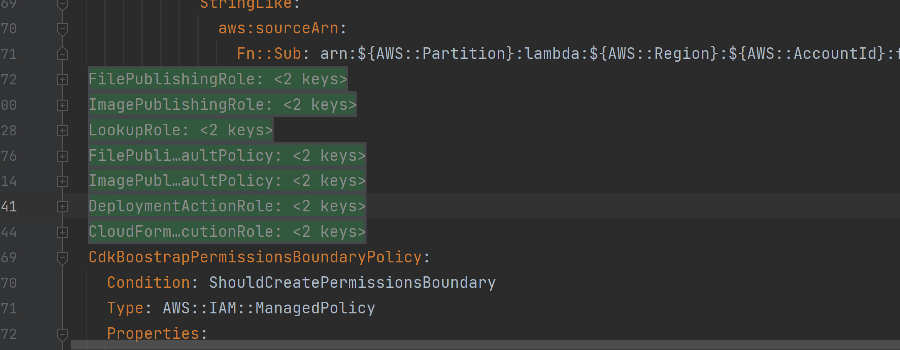
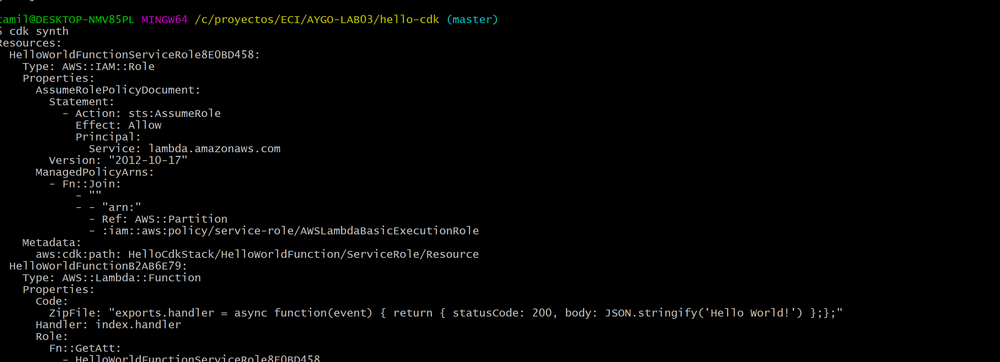

# Desafío Práctico con CDK (cloud development kit)


El objetivo de este desafío es introducir al estudiante al CDK a través de un ejercicio práctico. CDK es un framework de Infraestructura como Código diseñado para permitir a los arquitectos diseñar topologías de infraestructura complejas para la nube utilizando las abstracciones de lenguajes de programación comunes.

## Pasos del Desafío

Para completar el desafío con AWS-CLI, Cloudformation y CDK, el estudiante debe completar los siguientes pasos:

1. **Instalar CDK-CLI**: Sigue las instrucciones proporcionadas en la documentación oficial:
   [Introducción a AWS CDK](https://docs.aws.amazon.com/cdk/v2/guide/getting_started.html)

2. **Desarrollar una Aplicación Web Simple**: Utiliza una función lambda con CDK. Para completar este paso, sigue el tutorial en:
   [Tutorial Hello World de AWS CDK](https://docs.aws.amazon.com/cdk/v2/guide/hello_world.html)

3. **Subir a GitHub**: Sube la aplicación desarrollada a un repositorio en GitHub.

4. **Escribir un Informe**: Documenta tu experimento en el README del repositorio de GitHub. Asegúrate de agregar capturas de pantalla y evidencia de tus resultados.

¡Buena suerte!


## Creando el proyecto CDK

para crear un proyecto CDK nuevo, este debe tener su propio directorio, para esto ejecutaremos el siguiente comando, el cual le crea su propio directorio y nos deja en esta carpeta

```bash
mkdir hello-cdk && cd hello-cdk
```


ahora para inicializar un proyecto cdk utilizaremos cdk init y en nuestro case lo haremos en base a java
```bash
cdk init app --language java
```


si todo sale bien en nuestra carpeta se creo una estructura java como la siguiente


## Ahora procederemos a configurar el ambiente de AWS

primero debemos determinar el ambiente que usaremos, para esto necesitamos determinar 
1. Cuenta AWS
2. Region de AWS

en mi caso tengo la siguiente informacion, desde el gui de aws

```
AWSAccountId	134744162619
Region	us-east-1
```


pero si desea consultarla desde consola, puede usar el siguiente comando 


si necesitaras saber la region configurada de tu aws cli

```bash
aws configure get region
```

ahora vamos a modificar nuestro HellocdkApp, de tal manera que tome la configuracion de nuestra cuenta

```java
public class HelloCdkApp {
    private static final String awsAccountId = System.getenv("awsAccountId");
    private static final String awsRegion = System.getenv("awsRegion");

    public static void main(final String[] args) {
        App app = new App();

        new HelloCdkStack(app, "HelloCdkStack", StackProps.builder()
                .env(Environment.builder()
                        .account(awsAccountId)
                        .region(awsRegion)
                        .build())
                // If you don't specify 'env', this stack will be environment-agnostic.
                // Account/Region-dependent features and context lookups will not work,
                // but a single synthesized template can be deployed anywhere.

                // Uncomment the next block to specialize this stack for the AWS Account
                // and Region that are implied by the current CLI configuration.
                /*
                .env(Environment.builder()
                        .account(System.getenv("CDK_DEFAULT_ACCOUNT"))
                        .region(System.getenv("CDK_DEFAULT_REGION"))
                        .build())
                */

                // Uncomment the next block if you know exactly what Account and Region you
                // want to deploy the stack to.


                // For more information, see https://docs.aws.amazon.com/cdk/latest/guide/environments.html
                .build());

        app.synth();
    }
}
```

en el stack es donde iremos colocando los componentes que queremos instanciar

```java
new HelloCdkStack(app, "HelloCdkStack", StackProps.builder()
                .env(Environment.builder()
                        .account(awsAccountId)
                        .region(awsRegion)
                        .build())
```

### Paso 3: Bootstrap de tu Entorno AWS

Bootstrap, para crear mi aplicacion necesito ciertos recursos de AWS

En este paso, harás un bootstrap de tu entorno AWS que configuraste en el paso anterior. Esto prepara tu entorno para los despliegues con CDK.

Para hacer el bootstrap de tu entorno, ejecuta el siguiente comando desde la raíz de tu proyecto CDK:
```bash
cdk bootstrap
```

pero al no tener permisos en el rol debemos ejecutar el siguiente comando


vamos a basarnos en  un template en especifico
```bash
cdk bootstrap --show-template > bootstrap-template.yaml
```

nos vamos a ese archivo y documentamos todos los elementos que contengan la palabra ROL en recursos



y en el recurso 

```
FileAssetsBucketEncryptionKey

cambiamos

Fn::Sub: ${FilePublishingRole.Arn} -> Fn::Sub: "*"
```

ahora desplegaremos nuestros recursos con la plantilla bootstrap generada, para eso ejecutaremos el siguiente comando


```bash
cdk bootstrap --template bootstrap-template.yaml
```

si todo sale bien, nos debio haber creado los recursos en cloud formation 


## Paso 4: Crea tu aplicación CDK

En la mayoría de los entornos de programación, el código se crea o compila después de realizar cambios. Esto no es necesario AWS CDK con el CDK CLI realizará este paso automáticamente. Sin embargo, puedes seguir compilando manualmente si quieres atrapar errores de sintaxis y de tipo. A continuación, se muestra un ejemplo:


```bash
mvn compile -q
```

## Paso 5: Haz una lista de las CDK pilas de tu aplicación

En este punto, deberías tener una CDK aplicación que contenga una sola CDK pila. Para verificarlo, usa la CDK CLI cdk listcomando para mostrar las pilas. El resultado debe mostrar una sola pila llamadaHelloCdkStack:

```bash
cdk list
```


## 03-Build application and Deploy

### Paso 6: Defina la función Lambda

En este paso, se importa el aws_lambda módulo de la biblioteca de AWS construcciones y se utiliza la construcción Function L2.

Modifique el archivo de CDK pila de la siguiente manera:

```java
package com.myorg;

import software.constructs.Construct;
import software.amazon.awscdk.Stack;
import software.amazon.awscdk.StackProps;
// Import Lambda function
import software.amazon.awscdk.services.lambda.Code;
import software.amazon.awscdk.services.lambda.Function;
import software.amazon.awscdk.services.lambda.Runtime;

public class HelloCdkStack extends Stack {
  public HelloCdkStack(final Construct scope, final String id) {
    this(scope, id, null);
  }

  public HelloCdkStack(final Construct scope, final String id, final StackProps props) {
    super(scope, id, props);

    // Define the Lambda function resource
    Function myFunction = Function.Builder.create(this, "HelloWorldFunction")
      .runtime(Runtime.NODEJS_20_X) // Provide any supported Node.js runtime
      .handler("index.handler")
      .code(Code.fromInline(
        "exports.handler = async function(event) {" +
        " return {" +
        " statusCode: 200," +
        " body: JSON.stringify('Hello World!')" +
        " };" +
        "};"))
      .build();

  }
}
```

## Paso 7: Defina la función Lambda URL

En este paso, se utiliza el método addFunctionUrl auxiliar de la Function construcción para definir una función URL Lambda. Para generar el valor de este valor URL en el despliegue, creará una AWS CloudFormation salida utilizando la CfnOutput construcción.

Añada lo siguiente a su archivo de CDK pila:


```java
package com.myorg;

// ...
// Import Lambda function URL
import software.amazon.awscdk.services.lambda.FunctionUrl;
import software.amazon.awscdk.services.lambda.FunctionUrlAuthType;
import software.amazon.awscdk.services.lambda.FunctionUrlOptions;
// Import CfnOutput
import software.amazon.awscdk.CfnOutput;

public class HelloCdkStack extends Stack {
  public HelloCdkStack(final Construct scope, final String id) {
    this(scope, id, null);
  }

  public HelloCdkStack(final Construct scope, final String id, final StackProps props) {
    super(scope, id, props);

    // Define the Lambda function resource
    // ...

    // Define the Lambda function URL resource
    FunctionUrl myFunctionUrl = myFunction.addFunctionUrl(FunctionUrlOptions.builder()
      .authType(FunctionUrlAuthType.NONE)
      .build());

    // Define a CloudFormation output for your URL
    CfnOutput.Builder.create(this, "myFunctionUrlOutput")
      .value(myFunctionUrl.getUrl())
      .build();
  }
}
```

## Paso 8  Sintetizar una plantilla CloudFormation


syntetizar es preparar el codigo para deployment, generando un template para cloud formation

En este paso, se prepara para el despliegue sintetizando una plantilla con CloudFormation CDK CLI cdk synthcomando. Este comando realiza una validación básica del CDK código, ejecuta la CDK aplicación y genera una CloudFormation plantilla a partir de la CDK pila.

Si tu aplicación contiene más de una pila, debes especificar qué pilas quieres sintetizar. Como tu aplicación contiene una sola pila, CDK CLI detecta automáticamente la pila que se va a sintetizar.

Si no sintetiza una plantilla, la CDK CLI realizará este paso automáticamente cuando la despliegues. Sin embargo, le recomendamos que ejecute este paso antes de cada implementación para comprobar si hay errores de síntesis.

Antes de sintetizar una plantilla, si lo desea, puede crear su aplicación para detectar errores de sintaxis y de tipo. Para obtener instrucciones, consulte Paso 4: Crea tu aplicación CDK.

Para sintetizar una CloudFormation plantilla, ejecuta lo siguiente desde la raíz del proyecto:


```bash
cdk synth
```




## Despliegue su pila CDK

En este paso, utiliza el CDK CLI cdk deploycomando para desplegar tu CDK pila. Este comando recupera la CloudFormation plantilla generada y la despliega mediante ella AWS CloudFormation, lo que aprovisiona los recursos como parte de una CloudFormation pila.

Desde la raíz del proyecto, ejecuta lo siguiente. Confirma los cambios si se te solicita:

debemos usar el rol LabRole (revisar IAM)


```bash
cdk deploy -r arn:aws:iam::134744162619:role/LabRole
```